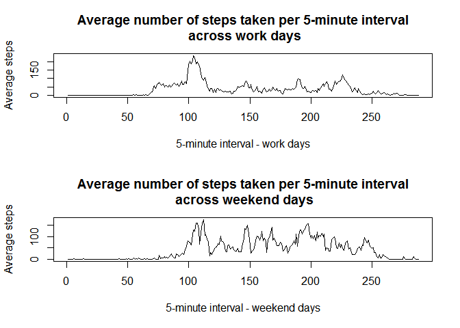

# Reproducible Research: Peer Assessment 1

The data consists of two months of data from an anonymous individual collected during the months of October and November, 2012 and include the number of steps taken in 5 minute intervals each day.

Dataset: Activity monitoring data [52K]
The variables included in this dataset are:

steps: Number of steps taking in a 5-minute interval (missing values are coded as NA)
date: The date on which the measurement was taken in YYYY-MM-DD format
interval: Identifier for the 5-minute interval in which measurement was taken
The dataset is stored in a comma-separated-value (CSV) file and there are a total of 17,568 observations in this dataset.

## Loading and preprocessing the data

The data set is on the cloud in a zip file

```r
# (1. Code for reading in the dataset and/or processing the data)

  url <- "https://d396qusza40orc.cloudfront.net/repdata%2Fdata%2Factivity.zip"
  zipfile <- "./repdata-data-activity.zip"
  file <- "activity.csv"

  if (!file.exists(file)) {
      if (!file.exists(zipfile)){
        download.file(url, destfile=zipfile)
      }
  unzip(zipfile, exdir=".")
  }
activity <- read.csv('activity.csv',header=TRUE, sep=',', stringsAsFactors = FALSE)
activity$date <- as.Date(activity$date, '%Y-%m-%d')
```

We will explore any pattern.

## What is mean total number of steps taken per day?


```r
# (2. Histogram of the total number of steps taken each day)

pace <- aggregate(steps ~ date,data = activity, sum)
pace$date <- as.Date(pace$date, '%Y-%m-%d')
hist(pace$steps, breaks = 20, col = "blue", main = 'Histogram of steps per day', xlab = 'Total steps per day', xlim = c(0,max(pace$steps)))
```


The maximum frequency is between 10,000 and 11,000 steps.

## What is the average daily activity pattern?


```r
# (4. Time series plot of the average number of steps taken)

media <- aggregate(steps ~ date,data = activity, mean)
media$date <- as.Date(media$date, '%Y-%m-%d')
plot(media, type='l', main = 'Average steps per day')
abline(h = mean(media$steps))
```


The horizontal line is the mean. There is almost no skew. The median is almost the same.


```r
# (3. Mean and median number of steps taken each day)

mean(pace$steps, na.rm = TRUE)
```

```
## [1] 10766.19
```

```r
median(pace$steps, na.rm = TRUE)
```

```
## [1] 10765
```

The pattern do not shows clues. Might be problems with missing values.

The 5-minute interval that, on average, contains the maximum number of steps is 167.


```r
# (5. The 5-minute interval that, on average, contains the maximum number of steps)

interval <- aggregate(steps ~ interval,data = activity, mean)
max <- max(interval$steps)
print(max)
```

```
## [1] 206.1698
```

```r
interval[,1][interval[,2]==max]/5
```

```
## [1] 167
```

Each hour has 12 intervals. 24 hours has 288 intervals. 167 is near 2 at afternoon.

## Imputing missing values

Each day has 288 intervals. And, there are not days with partial data. Only 8 days with no 'steps' data at all.


```r
# (6. Code to describe and show a strategy for imputing missing data)

DaysWithMissingData <- activity[!complete.cases(activity),]
DaysWithMissingData$date <- as.Date(DaysWithMissingData$date, '%Y-%m-%d')
table(DaysWithMissingData$date)
```

```
## 
## 2012-10-01 2012-10-08 2012-11-01 2012-11-04 2012-11-09 2012-11-10 
##        288        288        288        288        288        288 
## 2012-11-14 2012-11-30 
##        288        288
```

We can fill in all of the missing values in the dataset with the mean of the weekday-interval.

First let's add the weekday of the date.


```r
activityWeekday <- cbind(activity,as.data.frame(weekdays(activity$date,abbreviate=FALSE),stringsAsFactors= FALSE))
colnames(activityWeekday)[4] <- "weekday"
```

Second let's calculate the mean by weekday and interval.


```r
meanWeekday <- aggregate(steps ~ weekday + interval,data = activityWeekday, mean)
```

Third let's merge that 'mean' in a new data frame:


```r
imputation <- merge(activityWeekday,meanWeekday,by = c('interval','weekday'))
tail(imputation)
```

```
##       interval weekday steps.x       date  steps.y
## 17563      955 viernes      46 2012-11-02 6.571429
## 17564      955 viernes       0 2012-10-12 6.571429
## 17565      955 viernes       0 2012-10-05 6.571429
## 17566      955 viernes       0 2012-10-19 6.571429
## 17567      955 viernes       0 2012-10-26 6.571429
## 17568      955 viernes      NA 2012-11-09 6.571429
```

```r
imputation[is.na(imputation[,3]),3] <- imputation[is.na(imputation[,3]),5]
tail(imputation)
```

```
##       interval weekday   steps.x       date  steps.y
## 17563      955 viernes 46.000000 2012-11-02 6.571429
## 17564      955 viernes  0.000000 2012-10-12 6.571429
## 17565      955 viernes  0.000000 2012-10-05 6.571429
## 17566      955 viernes  0.000000 2012-10-19 6.571429
## 17567      955 viernes  0.000000 2012-10-26 6.571429
## 17568      955 viernes  6.571429 2012-11-09 6.571429
```

```r
# Let's make aesthetics changes
colnames(imputation)[3] <- "steps"
imputation$steps.y <- NULL
 rm(meanWeekday)
```

Finally, we can see if there is any change.


```r
# (7. Histogram of the total number of steps taken each day after missing values are imputed)

paceimp <- aggregate(steps ~ date,data = imputation, sum)
paceimp$date <- as.Date(paceimp$date, '%Y-%m-%d')
hist(paceimp$steps, breaks = 20, col = "blue", main = 'Histogram of steps per day', xlab = 'Total steps per day', xlim = c(0,max(paceimp$steps)))
```


Now the maximum frequency is between 12,000 and 13,000 steps too.

May be there is any pattern in weekdays and weekend days:

## Are there differences in activity patterns between weekdays and weekends?


```r
# (8. Panel plot comparing the average number of steps taken per 5-minute interval across weekdays and weekends)

days.of.week <- weekdays(x=as.Date(seq(7), origin="1950-01-01"))
imputation[,5] <- imputation[,2] %in% days.of.week[6:7]
colnames(imputation)[5] <- "weekend"
meanWeekend <- aggregate(steps ~ weekend + interval,data = imputation, mean)
plot.new()
par(mfrow = c(2,1))
plot(meanWeekend[,3][meanWeekend[,1]==FALSE], type='l', main = 'Average number of steps taken per 5-minute interval\n across work days', xlab = '5-minute interval - work days', ylab = 'Average steps')
plot(meanWeekend[,3][meanWeekend[,1]], type='l', main = 'Average number of steps taken per 5-minute interval\n across weekend days', xlab = '5-minute interval - weekend days', ylab = 'Average steps')
```



Effectively, there is a difference: On weekend, the day begins later, and the average steps are more distributed along the day.


